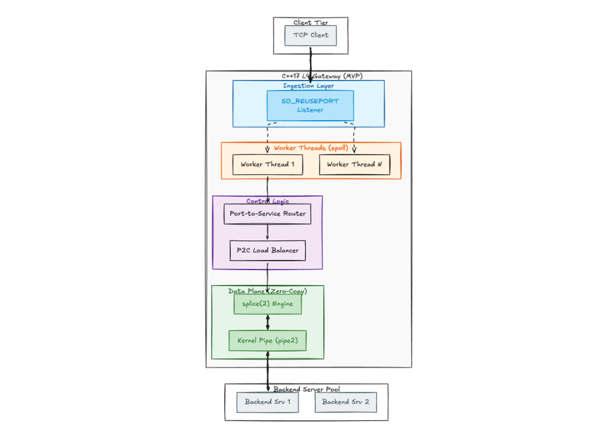

# ⚡ Trafix

> **High-Performance Asynchronous Layer 4 (L4) TCP Reverse Proxy & Gateway** built in **C++17** with Zero-Copy Linux Kernel Forwarding, Intelligent Load Balancing, Active Health Checking, and Real-Time Observability.

---

## 📌 Architecture Overview

Trafix is designed for ultra-low-latency and high-throughput TCP proxying. It leverages modern Linux kernel networking primitives (`epoll`, `SO_REUSEPORT`, `splice`, `pipe2`, `timerfd`) to distribute incoming TCP streams across worker threads and stream data directly through kernel buffers without copying bytes to user-space memory.



### 🧱 Architectural Layers

1. **Client Tier**:
   - External TCP clients establish connections to configured service listening ports (e.g., `:8081`, `:8443`).

2. **Ingestion Layer (`SO_REUSEPORT`)**:
   - Listeners are configured with `SO_REUSEPORT` and `SO_REUSEADDR` (with `TCP_FASTOPEN`), allowing the Linux kernel to distribute incoming connections across all worker threads without lock contention.

3. **Worker Threads (`epoll`)**:
   - Automatically scales to available hardware concurrency (`std::thread::hardware_concurrency()`).
   - Each worker runs an independent, non-blocking `epoll` event loop managing client and backend socket lifecycles.

4. **Control Logic**:
   - **Port-to-Service Router**: Maps incoming listening ports to target service pools defined in the configuration.
   - **P2C Load Balancer**: Implements the **Power-of-Two-Choices (P2C)** algorithm to randomly sample two healthy backend instances and route traffic to the one with fewer active connections, complete with automatic failover retry loops.

5. **Data Plane (Zero-Copy)**:
   - Allocates non-blocking bidirectional anonymous kernel pipes (`pipe2`) per connection.
   - Uses `splice(2)` system calls with `SPLICE_F_MOVE | SPLICE_F_NONBLOCK` to transfer bytes directly between client and backend file descriptors in kernel memory, eliminating user-space buffer copies.

6. **Backend Server Pool**:
   - Upstream TCP services receiving forwarded streams.

---

## ✨ Key Features

- **🚀 Kernel Zero-Copy Forwarding**: Direct socket-to-pipe-to-socket transfers using Linux `splice(2)` for minimal CPU utilization and sub-millisecond latencies.
- **⚡ Multi-Core Scalability**: Multi-worker architecture using `SO_REUSEPORT` for kernel-level connection dispatching.
- **⚖️ Intelligent Load Balancing (P2C)**: Power-of-Two-Choices algorithm balances loads effectively and mitigates "herd behavior" across backend clusters.
- **🩺 Active & Passive Health Monitoring**:
  - Passive instant detection via `EPOLLRDHUP` watch sockets.
  - Active periodic recovery probing driven by Linux `timerfd`.
- **🔄 Zero-Downtime Hot Reload (`SIGHUP`)**: Dynamically updates routes and backends from `gateway.yaml` at runtime without dropping active in-flight TCP sessions.
- **📊 Real-Time Observability & Web Dashboard**:
  - Per-thread lock-free circular ring buffers (`EventQueue`) with atomic acquire/release semantics.
  - Dedicated `ObservabilityWorker` exposing JSON metrics over a Unix Domain Socket (`/tmp/gateway_admin.sock`).
  - Sleek Node.js/Express web dashboard displaying live topology, throughput, and streaming event logs.

---

## 📂 Project Structure

```
BFCTCB/
├── assets/
│   └── architecture.png        # System architecture diagram
├── config/
│   └── gateway.yaml            # Service and routing configuration
├── dashboard/                  # Observability UI & Node.js Server
│   ├── public/                 # Glassmorphism Web Dashboard
│   │   ├── index.html
│   │   ├── styles.css
│   │   └── app.js
│   ├── server.js               # Express API querying Unix Domain Socket
│   └── package.json
├── include/
│   └── common/
│       └── types.h             # Core type definitions & constants
├── src/
│   ├── config/                 # YAML configuration parser (yaml-cpp)
│   │   ├── config_parser.cpp
│   │   ├── config_parser.h
│   │   └── config_types.h
│   ├── core/                   # Network engine & I/O primitives
│   │   ├── data_forwarder.cpp  # Kernel pipe allocation & management
│   │   ├── data_forwarder.h
│   │   ├── event_loop.cpp      # Non-blocking epoll loop & splice engine
│   │   ├── event_loop.h
│   │   ├── health_checker.cpp  # timerfd & socket health monitor
│   │   ├── health_checker.h
│   │   ├── socket_utils.cpp    # Socket helpers (SO_REUSEPORT, non-blocking)
│   │   └── socket_utils.h
│   ├── observability/          # Lock-free metric collection & IPC
│   │   ├── observer.cpp
│   │   └── observer.h
│   ├── routing/                # Route table & load balancing logic
│   │   ├── load_balancer.cpp   # Power-of-Two-Choices (P2C) implementation
│   │   ├── load_balancer.h
│   │   ├── router.cpp
│   │   └── router.h
│   └── main.cpp                # Gateway entry point & worker coordinator
├── CMakeLists.txt              # CMake build definitions (C++17)
├── Dockerfile                  # Multi-stage Docker container build
└── docker-compose.yml          # Container orchestration for dev & dashboard
```

---

## 🛠️ Getting Started

### Prerequisites

- **Linux OS** (Kernel 4.5+ recommended for `splice` and `SO_REUSEPORT`)
- **C++17 Compiler** (`g++` or `clang++`)
- **CMake** (3.16+)
- **Docker & Docker Compose** (Optional, for containerized execution)
- **Node.js** (v18+, for the observability dashboard)

---

### Running with Docker Compose (Recommended)

To launch both the Trafix Gateway and the Observability Dashboard:

```bash
docker compose up --build
```

- **Dashboard UI**: `http://localhost:3000`
- **Gateway Services**: Configured ports (e.g., `:8081`, `:8443`)

---

### Manual Compilation & Execution

1. **Build the Gateway**:
   ```bash
   mkdir -p build && cd build
   cmake .. -DCMAKE_BUILD_TYPE=Release
   make -j$(nproc)
   ```

2. **Run the Gateway**:
   ```bash
   ./gateway --config ../config/gateway.yaml
   ```

3. **Launch the Dashboard (Optional)**:
   ```bash
   cd ../dashboard
   npm install
   npm start
   ```
   Open `http://localhost:5991` (or configured port) in your browser.

---

## ⚙️ Configuration (`gateway.yaml`)

Define incoming listener ports and upstream backend pools in `config/gateway.yaml`:

```yaml
gateway:
  services:
    - name: "web-service"
      listen_port: 8081
      backends:
        - host: "127.0.0.1"
          port: 3005
        - host: "127.0.0.1"
          port: 3002
        - host: "127.0.0.1"
          port: 3003

    - name: "api-service"
      listen_port: 8443
      backends:
        - host: "127.0.0.1"
          port: 4001
        - host: "127.0.0.1"
          port: 4002
        - host: "127.0.0.1"
          port: 4003
```

### Hot Reloading Configuration

To apply changes to `gateway.yaml` without restarting the process or dropping existing connections:

```bash
pkill -HUP gateway
```

---

## 🔬 Core Technical Details

### Zero-Copy `splice(2)` Pipeline
Traditional proxies copy data from kernel space to user space (`read`), then from user space back to kernel space (`write`). Trafix bypasses user space entirely:

$$\text{Client Socket FD} \xrightarrow{\text{splice(2)}} \text{Kernel Pipe Buffer} \xrightarrow{\text{splice(2)}} \text{Backend Socket FD}$$

### Power-of-Two-Choices (P2C) Load Balancing
For every new incoming connection:
1. Filter the backend pool for instances where `is_healthy == true`.
2. Randomly select two candidate backends: $B_1$ and $B_2$.
3. Choose $\operatorname{argmin}(\text{active\_connections}(B_1), \text{active\_connections}(B_2))$.
4. If connection fails, immediately mark the backend unhealthy, decrement active connections, and failover to remaining healthy candidates.

---

## 📄 License

This project is licensed under the MIT License.
